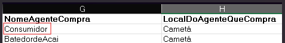
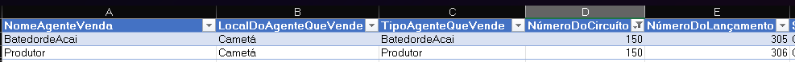

## Esta seção apresenta a documentação do código do algoritmo das Contas Sociais Alfa (CSalpha)

### Vocabulário

- **TbExtensa**: Tabela compilada com dados de pesquisa de campo gerada pelo Netz
        
- **Lançamento**: Representa um valor de campo numa linha na **TbExtensa**.

- **Circuito**: composição de lançamentos que fecha um circuito (movimento) que vai da produção ao consumo final daquele mesmo volume de produto. para cada lançamento que se faça este precisa se desdobrar nas demais informações que levem ao fechamento do circuito. A unidade de informação completa equivale ao fechamento do circuito.

### Estrutura do projeto

O projeto é composto por 4 **Classes** principais que abrigam uma coleção de funcionalidades idealizadas para construir as matrizes das CSAlpha:

O que é uma classe?

Uma <b>Classe</b> é uma estrutura de código que define um tipo específico de objeto. Ela agrupa dados e funcionalidades relacionadas de maneira lógica. Esses dados e funcionalidades são representados por <b>atributos</b> e <b>métodos</b>

<b>Atributos:</b> São as variáveis que armazenam dados sobre o objeto. Cada instância da classe pode ter valores diferentes para esses atributos.

<b>Métodos:</b> São funções definidas dentro da classe que operam sobre os dados dos atributos ou realizam outras operações.

Veja a documentação oficial do <a href="https://docs.python.org/pt-br/3/tutorial/classes.html">Python</a>.

- **Launcher**: recebe e gerencia lançamentos para montar circuitos.
- **Circuit**: gerencia lançamentos para formação de circuitos.
- **Table**: consolida os dados dos circutos.
- **Matrices**: gera e manipula matrizes preço, quantidade, valor, preço implícito e m. paramêtrica

## Documentação das Classes

### Launcher
::: launcher.launcher
    handler: python
    rendering:
            show_root_heading: no
            heading_level: 3
    selection:
      docstring_style: google  # this is the default
      docstring_options:
        replace_admonitions: no

---

### Circuit

::: circuit.circuit
    handler: python
    rendering:
            show_root_heading: no
            heading_level: 3
    selection:
      docstring_style: google  # this is the default
      docstring_options:
        replace_admonitions: no

---

### Table

::: table.table
    handler: python
    rendering:
            show_root_heading: no
            heading_level: 3
    selection:
      docstring_style: google  # this is the default
      docstring_options:
        replace_admonitions: no

---

### Matrices

::: matrices.matrices
    handler: python
    rendering:
            show_root_heading: no
            heading_level: 3
    selection:
      docstring_style: google  # this is the default
      docstring_options:
        replace_admonitions: no

---